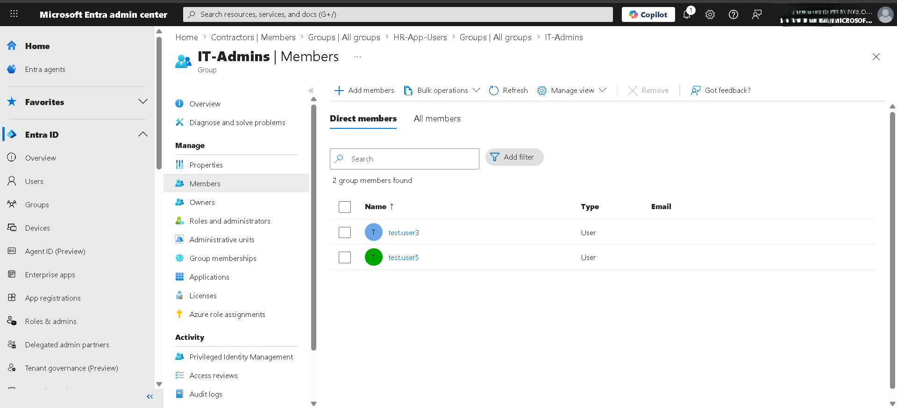
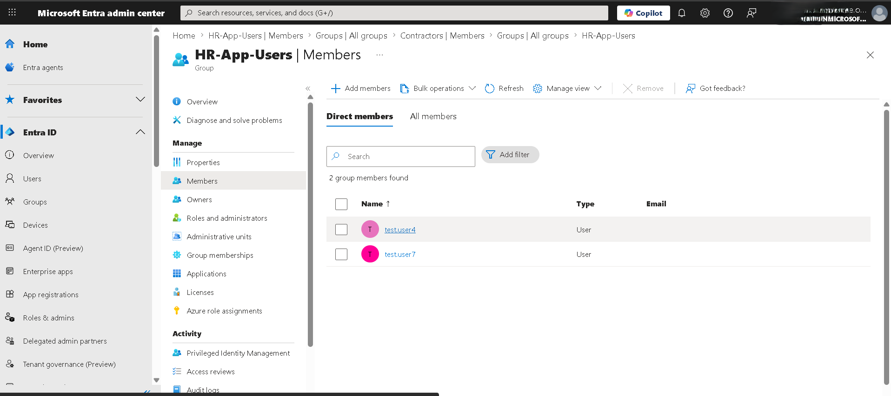

# entra-manual-access-review

## Project Purpose
Create a **manual access review package" in **Microsoft Entra ID** by validating user access (group membership) against a **role-to-group source-of-truth matrix**.

## What this demonstrates
- IAM fundamentals (least privilege, access governance)
- Manual access review workflow when automated reviews (Entra ID P2 license) are unavailable
- Clear documentation: findins, risk statements, recommendations, and evidence

  ##Lab environment (setup)
  ### Groups created
  -'HR-App-Users'
  -'Contractors'
  -IT-Admins'

  ### Users created

  -'test.user1'
  -'test.user2'
  -'test.user3'
  -'test.user4'
  -'test.user5'
  -'test.user6'
  -'test.user7'
  -'test.user8'

  ## Review method
  Because Entra ID P2 was not available, the access review was completed **manually** by:
  1. Reviewing current group membership for each user
  2. Comparing membership to the **Role-to-Group Access Matrix**
  3. Flagging mismatches as findings
  4. Documenting risk + recommendation and capturing evidence screenshots

  ## Role-to-Group Access Matrix (source of truth)
| Role/Title | Division | Expected Entra Group(s) | Notes/Justification |
|---|---|---|---|
| HR Coordinator / Talent Acquisition | HR | HR-App-Users | Access to HR app |
| Contractor (e.g., Cleaning, Electrician, Landscape) | Contractor | Contractors | Limited access |
| IT Admin | IT | IT-Admins | Privileged admin tasks |
| Vendor (e.g., Outsource Market) | Vendor | Contractors | Treat vendors as contractors in this lab |

## User-to-Role Mapping
| User | Role/Title | Division |
|---|---|---|
| test.user1 | HR Coordinator | HR |
| test.user2 | Cleaning contractor | Contractor |
| test.user3 | Electrician | Contractor |
| test.user4 | Talent Acquisition | HR |
| test.user5 | IT Trainee | IT |
| test.user6 | Outsource Market | Vendor |
| test.user7 | Equipment Technician | IT |
| test.user8 | Landscape | Contractor |

## Findings summary (recommendations only — pending approval)
Two users were found to be mismatched to the role-to-group matrix.

| User | Current group | Expected group | Risk / Why it matters | Recommendation | Status | Evidence |
|---|---|---|---|---|---|---|
| `test.user3` | `IT-Admins` | `Contractors` | Excess privilege: contractor has access intended for IT admins. Compromise could impact admin-level resources. | Remove from `IT-Admins`; add to `Contractors` | Pending approval | `evidence/it-admins.png` |
| `test.user7` | `HR-App-Users` | `IT-Admins` | Incorrect access assignment: user may lack required IT access and has unnecessary HR app access. | Remove from `HR-App-Users`; add to `IT-Admins` | Pending approval | `evidence/hr-app-users.png` |

## Evidence
### `test.user3` — IT-Admins membership

### `test.user7` — HR-App-Users membership

## Assumptions / limitations
- Entra ID P2 was not available, so access reviews were performed manually.
- For lab simplicity, all IT roles are mapped to `IT-Admins`.
- In a real environment, IT access would be separated into standard IT groups vs privileged admin groups.
- No changes were implemented in this lab; findings are documented as recommendations pending approval.
